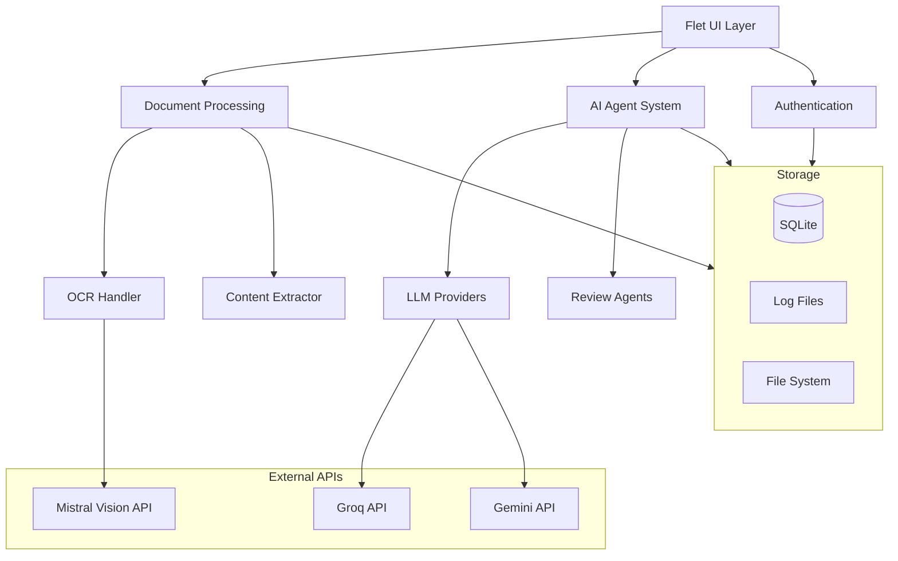

# Architecture Overview

## System Architecture

The Technical Writing Assistant follows a modular, layered architecture designed for scalability and maintainability.

## Component Overview

### User Interface Layer
- **Framework**: Flet (Flutter-based Python UI)
- **Pattern**: View-based navigation with shared app state
- **Features**: Reactive updates, modern material design
- **Views**: Home, Review, Settings, Login

### Document Processing Layer
- **Coordinator**: DocumentProcessor orchestrates all processing
- **Text Extraction**: ContentExtractor for readable documents
- **OCR Processing**: OCRHandler using Mistral Vision API
- **Intelligence**: Automatic processing method selection

### AI Agent System
- **Manager**: AgentManager coordinates multi-agent reviews
- **Providers**: LLMManager handles multiple API providers
- **Agents**: Specialized reviewers (Technical, Brand, Formatting, Diagram)
- **Prompts**: Structured templates for consistent AI interactions

### Data Storage Layer
- **Primary Database**: SQLite for session and finding storage
- **File Storage**: Local filesystem for documents and logs
- **Models**: Structured data classes for consistency

## Key Design Principles

### Modularity
- **Separation of Concerns**: Each module has a single responsibility
- **Loose Coupling**: Modules interact through well-defined interfaces
- **Testability**: Components can be tested in isolation
- **Extensibility**: New features can be added without major refactoring

### Reliability
- **Error Handling**: Comprehensive exception handling throughout
- **Fallback Mechanisms**: Multiple providers and processing methods
- **Logging**: Structured logging for debugging and monitoring
- **Data Persistence**: All operations tracked in database

### Performance
- **Async Operations**: Non-blocking UI during processing
- **Caching**: Response caching for repeated operations
- **Optimization**: Intelligent model and provider selection
- **Resource Management**: Proper cleanup and memory management

## Implementation Status

### ✅ Completed (Phase 1 + Phase 2 Steps 1-2)

**Core Infrastructure**
- Flet application framework with navigation
- Configuration management with environment variables
- Structured logging with Rich console output
- SQLite database with session tracking

**Document Processing**
- Multi-format document support (PDF, TXT, DOCX)
- OCR processing with Mistral Vision API
- Intelligent processing method selection
- Content extraction and validation

**AI Integration**
- LLM provider abstraction (Groq, Gemini)
- Provider fallback and error handling
- Technical review agent implementation
- Structured finding storage and retrieval

**User Interface**
- Modern Flet-based desktop application
- Authentication and session management
- Document upload with drag-and-drop
- Real-time processing feedback

### 🚧 In Progress (Phase 2 Completion)

**Multi-Agent System**
- Brand/presentation review agent
- Formatting and standards review agent
- Diagram and visual review agent
- Agent coordination and result aggregation

**Advanced Features**
- Comprehensive review report generation
- Export capabilities (PDF, JSON, etc.)
- Enhanced result visualization
- Performance optimization

### 📋 Planned (Future Phases)

**Enterprise Features**
- Role-based access control
- Multi-user collaboration
- API access for integrations
- Cloud deployment options

**Advanced Analysis**
- Machine learning model integration
- Custom review criteria
- Historical trend analysis
- Automated quality scoring

## Security Architecture

### Authentication
- JWT-based session management
- Password hashing with bcrypt
- Session timeout and renewal
- Login attempt limiting

### Data Protection
- Document encryption at rest
- Secure API key storage
- Input validation and sanitization
- Audit logging for compliance

### API Security
- Encrypted API communications
- Key rotation recommendations
- Rate limiting implementation
- Error message sanitization

## Deployment Architecture

### Development Environment
- Local SQLite database
- File-based logging
- Environment variable configuration
- Hot reload for development

### Production Considerations
- Database migration to PostgreSQL
- Centralized logging (Sentry integration)
- Configuration management
- Error monitoring and alerting

## Performance Characteristics

### Current Metrics
- Document processing: < 30 seconds for 10-page PDF
- AI review: < 60 seconds for technical analysis
- UI responsiveness: Real-time progress updates
- Memory usage: < 500MB for typical operations

### Optimization Strategies
- Lazy loading of AI providers
- Response caching with TTL
- Efficient text processing
- Minimal UI re-renders

## Technology Stack

### Core Dependencies
- **Flet**: ^0.21.2 - UI framework
- **PyMuPDF**: ^1.23.0 - PDF processing
- **httpx**: ^0.25.0 - HTTP client for APIs
- **structlog**: ^23.2.0 - Structured logging
- **cryptography**: ^41.0.0 - Security functions

### AI Dependencies
- **openai**: ^1.0.0 - Groq API compatibility
- **google-generativeai**: ^0.3.0 - Gemini API
- **langchain**: ^0.1.0 - AI framework utilities

### Development Dependencies
- **pytest**: ^7.4.0 - Testing framework
- **black**: ^23.0.0 - Code formatting
- **mypy**: ^1.7.0 - Type checking

## Extension Points

### Adding New Document Types
1. Extend `ContentExtractor` with new format support
2. Add format validation to `DocumentProcessor`
3. Update UI file picker configuration
4. Add format-specific tests

### Adding New AI Providers
1. Implement `LLMProvider` interface
2. Add provider to `LLMManager` initialization
3. Update configuration validation
4. Add provider-specific error handling

### Adding New Review Agents
1. Extend `BaseReviewAgent` class
2. Implement `review()` method
3. Add agent to `AgentManager`
4. Create agent-specific prompts

### Adding New UI Views
1. Create view class in `src/ui/views/`
2. Add navigation in `TechnicalWritingApp`
3. Update navigation rail destinations
4. Implement view-specific logic