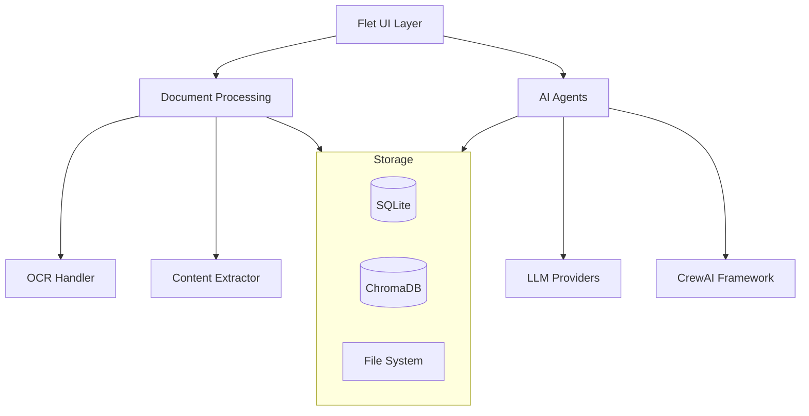

# Technical Writing Assistant

Welcome to the Technical Writing Assistant documentation. This application provides AI-powered review and analysis of technical documentation, with a focus on installation instructions for access control hardware.

## Overview

The Technical Writing Assistant is a desktop application built with Python and Flet that helps technical writers improve their documentation through automated review processes. The system uses multiple specialized AI agents to analyze different aspects of technical documents.

### Key Features

- **Document Processing**: Support for PDF, Word, and text documents
- **OCR Capability**: Process scanned documents and images
- **Multi-Agent Review**: Specialized agents for different review aspects
- **Modern Interface**: Clean, responsive desktop application
- **Comprehensive Logging**: Detailed logging and error tracking
- **Extensible Architecture**: Modular design for easy enhancement

## Quick Start

1. **Install the application**
   ```bash
   git clone <repository-url>
   cd tech-writer-assistant
   python setup_project.py
   ```

2. **Configure environment**
   ```bash
   cp .env.example .env
   # Edit .env with your API keys
   ```

3. **Run the application**
   ```bash
   python src/main.py
   ```

## Architecture

The application follows a modular architecture with clear separation of concerns:



## Phase 1 Status

Phase 1 is complete and includes:

- ✅ Document processing pipeline
- ✅ Modern Flet-based UI
- ✅ Comprehensive logging system
- ✅ Configuration management
- ✅ File upload and validation
- ✅ OCR support for scanned documents

## Next Steps

Phase 2 will add:

- AI agent implementation using CrewAI
- LLM integration (Grok and Gemini APIs)
- Advanced document analysis
- Review report generation
- Database storage for review history

## Support

- 📖 Read the [User Guide](user-guide/installation.md)
- 🔧 Check the [API Reference](api/overview.md)
- 🏗️ Learn about the [Architecture](architecture/overview.md)
- 🤝 See [Contributing Guidelines](development/contributing.md)